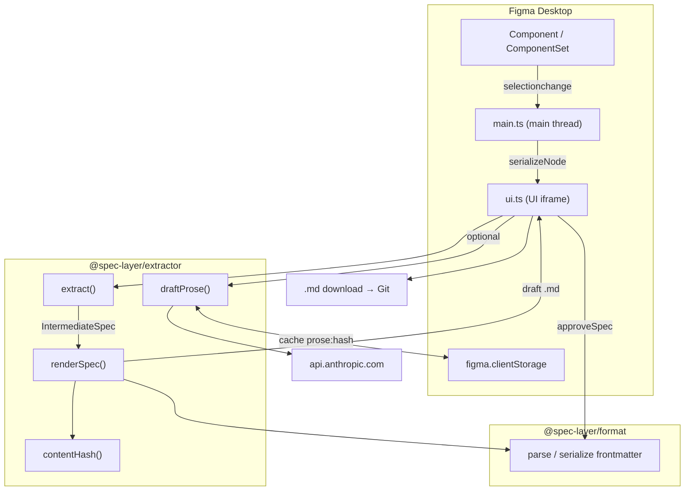

# Architecture

This document describes the architecture of **Spec Layer** — a system that turns Figma design-system components into human-approved, version-controlled Markdown specs that AI tools can trust.

## Table of contents

- [Overview](#overview)
- [The pipeline](#the-pipeline)
- [Repository layout](#repository-layout)
- [Packages](#packages)
  - [@spec-layer/format](#spec-layerformat)
  - [@spec-layer/extractor](#spec-layerextractor)
  - [@spec-layer/plugin](#spec-layerplugin)
- [Data flow](#data-flow)
- [Key design decisions](#key-design-decisions)
- [Build & tooling](#build--tooling)
- [Testing](#testing)
- [Roadmap](#roadmap)

---

## Overview

AI agents that consume raw, unreviewed design data hallucinate API shapes, invent prop names, and drift from what was actually shipped. Hand-written component docs go stale the moment a designer changes a variant. **Spec Layer** addresses both: a Figma plugin extracts components into structured Markdown, a human reviews and approves each spec, and the result is version-controlled text that downstream AI tools can read without guesswork.

The positioning, in one comparison:

| Source | What you get |
|---|---|
| **Raw feed** (Figma MCP / REST API) | Unreviewed JSON: node trees, raw fills, layout data — no approval, no lifecycle, no code mapping |
| **Reviewed contract** (Spec Layer) | Human-approved Markdown spec: anatomy, props, tokens, code mapping, usage rules, status |

---

## The pipeline

```
Extract → Approve → Store → Serve
```

1. **Extract** — The Figma plugin walks the selected component, serializes it into an `IntermediateSpec`, and optionally calls an LLM to draft prose sections (usage guidance, accessibility notes).
2. **Approve** — A reviewer edits the extracted spec in the plugin UI, then clicks Approve. Status advances from `draft` to `approved` and draft markers are stripped.
3. **Store** — The plugin exports the spec as a `.md` file conforming to the open Spec Layer format. It is committed to the repo.
4. **Serve** — AI tools, IDEs, and documentation pipelines read the versioned, approved spec from source control.

`Extract`, `Approve`, and local export are implemented today (Phases 0 + 1). `Store` (GitHub sync) and `Serve` (MCP server) are on the roadmap.

---

## Repository layout

```
.
├── package.json              # Root npm workspace (no turbo/pnpm)
├── package-lock.json         # npm lockfile
├── tsconfig.base.json        # Shared TS compiler options
├── vitest.config.ts          # Root test runner config
├── spec/
│   ├── SPEC.md               # Open format definition (v0.1, MIT)
│   └── examples/             # Reference specs: button, text-field, dialog
└── packages/
    ├── format/               # @spec-layer/format   — Markdown frontmatter
    ├── extractor/            # @spec-layer/extractor — pure extraction pipeline
    └── plugin/               # @spec-layer/plugin    — Figma plugin
```

The repo is an **npm workspaces** monorepo (`"workspaces": ["packages/*"]`). All packages are ESM (`"type": "module"`) and written in strict TypeScript. There is no Turbo, Nx, or pnpm — just npm and per-package `tsconfig.json` files extending `tsconfig.base.json`.

---

## Packages

The three packages form a clean dependency chain with no cycles:

```
@spec-layer/format          (depends on: yaml)
       ▲
@spec-layer/extractor       (depends on: format, js-sha256)
       ▲
@spec-layer/plugin          (depends on: extractor, format; builds with esbuild)
```

Responsibilities are sharply separated:

- **format** owns the Markdown *envelope* (YAML frontmatter parse/serialize/validate).
- **extractor** is *pure* — it transforms JSON into a spec with no Figma API access.
- **plugin** owns all Figma I/O and the review/approve/export UI.

### @spec-layer/format

Parses, serializes, and validates the YAML frontmatter block of a Spec Layer Markdown file. It does **not** parse the Markdown body.

```
packages/format/src/
├── index.ts          # Barrel re-exports
├── types.ts          # SpecFrontmatter, SpecStatus
└── frontmatter.ts    # parseFrontmatter, serializeFrontmatter
```

**Public API:**

| Export | Role |
|---|---|
| `SpecStatus` | `'draft' \| 'approved' \| 'deprecated'` |
| `SpecFrontmatter` | Full frontmatter schema (component identity, status, code mapping, `content_hash`) |
| `serializeFrontmatter(fm, body)` | Emits `---\n<yaml>\n---\n\n` + body |
| `parseFrontmatter(md)` | Validates and returns `{ frontmatter, body }` |

Validation is embedded in `parseFrontmatter`: it rejects missing frontmatter, a `spec_version` other than `0.1`, an invalid `status`, and missing `component.*` fields or `content_hash`.

**Dependency:** `yaml`.

### @spec-layer/extractor

A pure, Figma-agnostic pipeline: `SerializedNode` (plain JSON) → `IntermediateSpec` → Spec Layer Markdown. It includes an optional LLM prose layer (Anthropic).

```
packages/extractor/src/
├── index.ts          # Barrel re-exports
├── tree.ts           # SerializedNode — the plugin→extractor contract
├── anatomy.ts        # Shallow anatomy + related atoms
├── props.ts          # Configuration, variants, states
├── tokens.ts         # Token bindings + extraction gaps
├── layout.ts         # Layout summaries (used only for the prose prompt)
├── extract.ts        # Orchestrator → IntermediateSpec
├── hash.ts           # contentHash (canonical JSON → SHA-256)
├── render.ts         # IntermediateSpec → full .md file
└── prose/
    ├── prompt.ts     # buildProsePrompt, parseProseResponse
    └── client.ts     # draftProse (Anthropic + cache)
```

**Module responsibilities:**

| Module | Key exports | Responsibility |
|---|---|---|
| `tree.ts` | `SerializedNode`, `PropertyDefinition`, `TokenRef`, `LayoutInfo` | Stable JSON contract from the plugin serializer |
| `anatomy.ts` | `defaultVariant()`, `extractAnatomy()` | Shallow walk of the default variant; flags nested `INSTANCE`s |
| `props.ts` | `extractProps()`, `extractVariants()`, `extractStates()` | Maps Figma property defs; strips `#nodeId` suffixes; detects a State axis |
| `tokens.ts` | `extractTokens()`, `extractGaps()`, `variantDelta()` | Deep token walk; per-variant diffs; gap detection (unbound paint, raw typography, hardcoded layout) |
| `layout.ts` | `extractLayout()` | Human-readable layout summary for the LLM prompt (not rendered into the spec) |
| `extract.ts` | `IntermediateSpec`, `extract()` | Combines all extractors into one structure |
| `hash.ts` | `contentHash()` | Canonical (sorted-key) JSON → SHA-256 via `js-sha256` |
| `render.ts` | `renderSpec()` | Builds the 10 canonical sections + optional `## Extraction gaps`; calls `serializeFrontmatter` |
| `prose/prompt.ts` | `buildProsePrompt()`, `parseProseResponse()`, `ProseDrafts` | Builds the LLM prompt from derived fields only — never raw node JSON |
| `prose/client.ts` | `draftProse()`, `CacheStore`, `DraftOptions` | Anthropic `claude-haiku-4-5` call with cache key `prose:{contentHash}` |

**Dependencies:** `@spec-layer/format` (workspace), `js-sha256`.

### @spec-layer/plugin

The Figma plugin: it serializes the selected component on the main thread, runs the extractor pipeline inside the UI iframe, and drives the review/approve/export flow.

```
packages/plugin/
├── manifest.json           # Figma manifest (main, ui, networkAccess)
├── build.mjs               # esbuild bundling script
└── src/
    ├── main.ts             # Figma main thread: selection, serialization, clientStorage
    ├── serialize.ts        # Figma node → SerializedNode
    ├── messages.ts         # MainToUi / UiToMain message types
    └── ui/
        ├── ui.ts           # Vanilla DOM UI + extract/approve/download flow
        └── state.ts        # UI phase machine + approveSpec
```

**Key modules:**

| File | Role |
|---|---|
| `main.ts` | Boots `figma.showUI`, finds the enclosing `COMPONENT`/`COMPONENT_SET` via `findComponent()`, handles `selectionchange` and UI messages, bridges `figma.clientStorage` for the prose cache and API key |
| `serialize.ts` | `serializeNode()` async-walks the Figma tree, resolving bound variables and styles to token names, flagging unbound paints, and capturing auto-layout and `mainComponent` refs |
| `messages.ts` | Typed `postMessage` protocol between main thread and UI |
| `ui/ui.ts` | DOM shell + `runExtract()`, `runApprove()`, `runDownload()` |
| `ui/state.ts` | Phase machine (`nextStatus`, `resetToIdle`) and `approveSpec()` which flips status to `approved` and strips draft markers |

**Manifest:** `main` → `dist/main.js`, `ui` → `dist/ui.html`, `networkAccess` restricted to `https://api.anthropic.com`, panel sized 480×640.

**Dependencies:** `@spec-layer/extractor`, `@spec-layer/format` (runtime); `esbuild`, `@figma/plugin-typings` (dev).

There is no UI framework — the plugin UI is vanilla DOM with inline CSS in `ui.ts`.

---

## Data flow



Step by step:

1. **Selection** — The user selects a component. `main.ts` walks up the tree to the enclosing `COMPONENT_SET` or `COMPONENT`.
2. **Serialize** — `serializeNode()` recursively converts the node into a `SerializedNode`, resolving variables/styles to token names, detecting unbound paints, and capturing property definitions and auto-layout. The result is posted to the UI.
3. **Extract** — In the UI, `extract(node, { figmaFile })` produces an `IntermediateSpec` using only pure functions.
4. **Render** — `renderSpec()` emits draft Markdown with placeholders in the judgment sections.
5. **Draft prose (optional)** — If an Anthropic key is set, `draftProse()` checks the cache (`prose:{contentHash}`), otherwise calls the LLM with a prompt built from derived fields only, then re-renders.
6. **Review** — The user edits the spec in the UI.
7. **Approve** — `approveSpec()` re-parses the frontmatter, flips `status` to `approved`, records `approved_by`, and strips draft marker lines.
8. **Export** — The spec downloads as `{kebab-name}.md` for committing to Git.

### Message protocol

| Direction | Message | Purpose |
|---|---|---|
| Main → UI | `selection` | `{ node, fileKey }` for the current selection |
| Main → UI | `apiKey` | Stored Anthropic key on boot |
| Main → UI | `cacheValue` | Response to a cache get |
| UI → Main | `requestSelection` | Initial selection request on mount |
| UI → Main | `setApiKey` | Persist the API key |
| UI → Main | `cacheGet` / `cacheSet` | Prose cache via `clientStorage` |
| UI → Main | `notify` | Trigger a `figma.notify()` toast |

### UI phase machine

```
idle → extracting → drafting → review → approved
```

(`drafting` resolves to either `prose-done` or `prose-failed` before entering `review`.)

---

## Key design decisions

1. **Pure extractor, impure plugin.** The extractor never touches Figma APIs; it operates on plain JSON. This makes the whole pipeline unit-testable from JSON fixtures and keeps Figma-specific concerns isolated in the plugin.
2. **A stable contract type at the boundary.** `SerializedNode` (in `extractor/tree.ts`) is the single interface between the plugin's serializer and the extractor.
3. **Dependency injection for testability.** `NodeResolver` (serializer) and `CacheStore` (prose client) are injected, so tests can run without Figma globals or network access.
4. **Deterministic vs. judgment sections.** Structural sections (anatomy, props, tokens) are derived deterministically; judgment sections (Definition, Code, Accessibility, Do's & Don'ts) are LLM-drafted and carry a draft marker (`> ⚠️ Draft — AI-suggested, not yet approved.`) until a human approves. The exact marker string is shared between `render.ts` and `state.ts`.
5. **Shallow anatomy, deep tokens.** Anatomy intentionally only walks the direct children of the default variant, while token/gap extraction walks the full tree — an intentional asymmetry documented in `anatomy.ts`.
6. **Content hash for cache + drift.** `contentHash()` canonicalizes the `IntermediateSpec` (sorted keys) and hashes it with SHA-256. It is written into the frontmatter (enabling future drift detection) and used as the LLM prose cache key.
7. **Privacy-aware prompts.** The prose prompt is built from derived fields only — raw node JSON is never sent to the LLM.

---

## Build & tooling

| Concern | Choice |
|---|---|
| Package manager | npm workspaces (`package-lock.json`) |
| Language | TypeScript 5.6, strict, ESM |
| Test runner | Vitest 2.1 |
| Plugin bundler | esbuild 0.24 (IIFE, browser target ES2017) |
| YAML | `yaml` 2.5 |
| Hashing | `js-sha256` |
| LLM | Anthropic Messages API (`claude-haiku-4-5`) |
| UI framework | None (vanilla DOM) |

Only the **plugin** has a build step. `format` and `extractor` are consumed directly as TypeScript source through workspace resolution — there is no separate compile for them.

`node packages/plugin/build.mjs` produces two artifacts:

- `dist/main.js` — esbuild IIFE bundle of `src/main.ts`.
- `dist/ui.html` — esbuild IIFE bundle of `src/ui/ui.ts` embedded in a minimal HTML shell.

Root scripts:

- `npm test` — run all tests once.
- `npm run test:watch` — Vitest watch mode.
- `npm run typecheck` — `tsc --noEmit` across all three packages.

---

## Testing

Tests run under Vitest and live in `packages/*/test/`, mirroring the source modules:

- **Unit tests** per module (`anatomy.test.ts`, `props.test.ts`, `tokens.test.ts`, etc.).
- **Integration tests** for the full pipeline (`plugin/test/integration.test.ts`).
- **Golden fixtures** — pre-serialized input (`button.json`, `chip.json`) plus expected output (`button.golden.md`) under `extractor/test/fixtures/`.

The test config (`vitest.config.ts`) includes `packages/**/test/**/*.test.ts`.

---

## Roadmap

| Phase | Scope | Status |
|---|---|---|
| **0 — Format** | Open spec definition, YAML frontmatter, 10-section body | Done |
| **1 — Extractor + Plugin** | Node-tree pipeline, LLM prose layer, Figma plugin | Done |
| **2 — Sync + Drift** | GitHub push from plugin, drift detection via `content_hash` | Roadmap |
| **3 — MCP Server** | `get_spec` / `search_components` / `list_tokens` tools | Roadmap |
