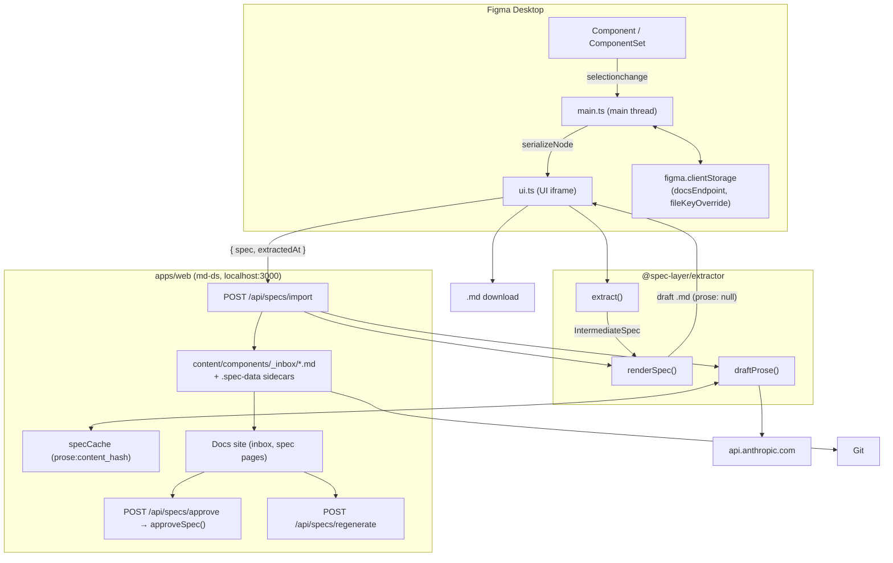

# Architecture

This document describes the architecture of **Spec Layer** — a system that turns Figma design-system components into human-approved, version-controlled Markdown specs that AI tools can trust.

## Table of contents

- [Overview](#overview)
- [The pipeline](#the-pipeline)
- [Repository layout](#repository-layout)
- [Packages and apps](#packages-and-apps)
  - [@spec-layer/format](#spec-layerformat)
  - [@spec-layer/extractor](#spec-layerextractor)
  - [@spec-layer/plugin](#spec-layerplugin)
  - [apps/web (md-ds)](#appsweb-md-ds)
- [Data flow](#data-flow)
- [Key design decisions](#key-design-decisions)
- [Build & tooling](#build--tooling)
- [Testing](#testing)
- [Roadmap](#roadmap)

---

## Overview

AI agents that consume raw, unreviewed design data hallucinate API shapes, invent prop names, and drift from what was actually shipped. Hand-written component docs go stale the moment a designer changes a variant. **Spec Layer** addresses both: a Figma plugin extracts components into a structured intermediate spec, a local docs web app renders it (optionally enriching it with AI-drafted prose), a human reviews and approves it there, and the result is version-controlled text that downstream AI tools can read without guesswork.

The positioning, in one comparison:

| Source | What you get |
|---|---|
| **Raw feed** (Figma MCP / REST API) | Unreviewed JSON: node trees, raw fills, layout data — no approval, no lifecycle, no code mapping |
| **Reviewed contract** (Spec Layer) | Human-approved Markdown spec: anatomy, props, tokens, code mapping, usage rules, status |

---

## The pipeline

```
Extract → Approve → Store → Serve
```

1. **Extract** — The Figma plugin walks the selected component, serializes it into an `IntermediateSpec`, and renders a structural-only draft (`prose: null`) for review in the plugin panel.
2. **Store** — The user clicks **Send to docs**: the plugin POSTs the raw `IntermediateSpec` to the docs web app (`/api/specs/import`). The web app drafts the prose sections server-side (when `ANTHROPIC_API_KEY` is configured), renders the full Markdown, and writes it into its content folder (`content/components/_inbox/`) along with a `.spec-data` JSON sidecar of the source extraction. Alternatively the user downloads the structural draft as a `.md` file.
3. **Approve** — A reviewer files the inbox draft and approves it in the web app. `POST /api/specs/approve` calls `approveSpec` from `@spec-layer/format`, which flips `status` from `draft` to `approved` and strips the draft markers. `POST /api/specs/regenerate` re-renders a spec from its stored extraction (re-running the prose pass).
4. **Serve** — The web app renders the content folder live as a navigable docs site; AI tools, IDEs, and documentation pipelines read the versioned, approved spec files from source control.

Extraction, the local Store, and approval in the web app are implemented today. GitHub sync and an MCP server are on the roadmap.

---

## Repository layout

```
.
├── package.json              # Root npm workspace (no turbo/pnpm)
├── package-lock.json         # npm lockfile (governs apps/web too)
├── tsconfig.base.json        # Shared TS compiler options
├── vitest.config.ts          # Root test runner config
├── spec/
│   ├── SPEC.md               # Open format definition (v0.1, MIT)
│   └── examples/             # Reference specs: button, text-field, dialog
├── packages/
│   ├── format/               # @spec-layer/format   — Markdown frontmatter + approval
│   ├── extractor/            # @spec-layer/extractor — pure extraction pipeline
│   └── plugin/               # @spec-layer/plugin    — Figma plugin (thin client)
└── apps/
    └── web/                  # md-ds — Next.js 14 docs app
        ├── content/components/        # Markdown content (specs land in _inbox/)
        └── src/
            ├── app/api/specs/         # import / approve / regenerate (+ move, figma-file)
            └── lib/                   # config, content, specWriter, specCache, specApi, …
```

The repo is an **npm workspaces** monorepo (`"workspaces": ["packages/*", "apps/*"]`). All packages are ESM (`"type": "module"`) and written in strict TypeScript. There is no Turbo, Nx, or pnpm — just npm and per-package `tsconfig.json` files extending `tsconfig.base.json`.

---

## Packages and apps

The three packages and one app form a clean dependency chain with no cycles:

```
@spec-layer/format          (depends on: yaml)
       ▲           ▲
@spec-layer/extractor       (depends on: format, js-sha256)
       ▲           ▲
@spec-layer/plugin │        (depends on: extractor, format; builds with esbuild)
                   │
        apps/web (md-ds)    (depends on: format, extractor, next/react)
```

Responsibilities are sharply separated:

- **format** owns the Markdown *envelope* (YAML frontmatter parse/serialize/validate) and the *approval* transform (`approveSpec`).
- **extractor** is *pure* — it transforms JSON into a spec with no Figma API access.
- **plugin** owns all Figma I/O: it extracts, shows a structural draft, and ships it to the docs app (or downloads it).
- **apps/web** owns prose drafting, storage, review/approval, and serving the docs.

### @spec-layer/format

Parses, serializes, and validates the YAML frontmatter block of a Spec Layer Markdown file, and implements the approval transform. It does **not** parse the rest of the Markdown body.

```
packages/format/src/
├── index.ts          # Barrel re-exports
├── types.ts          # SpecFrontmatter, SpecStatus
├── frontmatter.ts    # parseFrontmatter, serializeFrontmatter
└── approve.ts        # approveSpec, DRAFT_MARKER
```

**Public API:**

| Export | Role |
|---|---|
| `SpecStatus` | `'draft' \| 'approved' \| 'deprecated'` |
| `SpecFrontmatter` | Full frontmatter schema (component identity, status, code mapping, `content_hash`) |
| `serializeFrontmatter(fm, body)` | Emits `---\n<yaml>\n---\n\n` + body |
| `parseFrontmatter(md)` | Validates and returns `{ frontmatter, body }` |
| `approveSpec(markdown, approver)` | Flips `status` to `approved`, records `approved_by`, strips draft-marker lines from the judgment sections |
| `DRAFT_MARKER` | The canonical draft-marker string (`> ⚠️ Draft — AI-suggested, not yet approved.`) |

Validation is embedded in `parseFrontmatter`: it rejects missing frontmatter, a `spec_version` other than `0.1`, an invalid `status`, and missing `component.*` fields or `content_hash`.

**Dependency:** `yaml`.

### @spec-layer/extractor

A pure, Figma-agnostic pipeline: `SerializedNode` (plain JSON) → `IntermediateSpec` → Spec Layer Markdown. It includes an optional LLM prose layer (Anthropic) — invoked server-side by the docs web app, not by the plugin.

```
packages/extractor/src/
├── index.ts          # Barrel re-exports
├── tree.ts           # SerializedNode — the plugin→extractor contract
├── anatomy.ts        # Shallow anatomy + related atoms
├── props.ts          # Configuration, variants, states
├── tokens.ts         # Token rules (conditions) + extraction gaps
├── pivot.ts          # Tokens-used table shapes (categorize, color pivots, flat/fixed tables)
├── resolve.ts        # Resolve token rules for one concrete variant
├── layout.ts         # Layout summaries (used only for the prose prompt)
├── extract.ts        # Orchestrator → IntermediateSpec (incl. variantInstances)
├── hash.ts           # contentHash (canonical JSON → SHA-256)
├── render.ts         # IntermediateSpec → full .md file
└── prose/
    ├── prompt.ts     # buildProsePrompt, parseProseResponse
    └── client.ts     # draftProse (Anthropic + injected CacheStore)
```

**Module responsibilities:**

| Module | Key exports | Responsibility |
|---|---|---|
| `tree.ts` | `SerializedNode`, `PropertyDefinition`, `TokenRef`, `LayoutInfo` | Stable JSON contract from the plugin serializer |
| `anatomy.ts` | `defaultVariant()`, `extractAnatomy()` | Shallow walk of the default variant; descends through a sole FRAME/GROUP wrapper; dedupes parts by name; flags nested `INSTANCE`s |
| `props.ts` | `extractProps()`, `extractVariants()`, `extractStates()` | Maps Figma property defs; strips `#nodeId` suffixes; detects a State axis |
| `tokens.ts` | `TokenRule`, `extractTokens()`, `extractGaps()`, `parseVariantName()`, `formatConditions()` | Deep token walk across all variants, minimized into conditional `TokenRule`s (`part`, `property`, `conditions: axis → values`, `token`); gap detection (hardcoded color, raw typography, hardcoded layout) |
| `pivot.ts` | `categorize()`, `pivotColorPart()`, `flatPartTable()`, `flatGlobalTable()`, `fixedTable()`, `isModifierAxis()`, `isStateAxisName()`, `isUnconditioned()` | Shapes token rules into the `## Tokens used` tables: Color / Typography / Measurements categorization, per-part Material-style color pivots with `When X = v` modifier sub-tables and `Exceptions`, and the merged `Fixed` table |
| `resolve.ts` | `resolveTokensForVariant()`, `ResolvedToken` | Filters `TokenRule`s down to the ones matching a single variant's axis values |
| `layout.ts` | `extractLayout()` | Human-readable layout summary for the LLM prompt (not rendered into the spec) |
| `extract.ts` | `IntermediateSpec`, `VariantInstance`, `extract()` | Combines all extractors into one structure; `variantInstances` carries each physical variant's node id + parsed axis values so the docs site can fetch previews |
| `hash.ts` | `contentHash()` | Canonical (sorted-key) JSON → SHA-256 via `js-sha256` |
| `render.ts` | `renderSpec()` | Builds the 10 canonical sections + optional `## Extraction gaps`; calls `serializeFrontmatter` |
| `prose/prompt.ts` | `buildProsePrompt()`, `parseProseResponse()`, `ProseDrafts` | Builds the LLM prompt from derived fields only — never raw node JSON |
| `prose/client.ts` | `draftProse()`, `CacheStore`, `DraftOptions` | Anthropic `claude-haiku-4-5` call with cache key `prose:{contentHash}`; cache store and fetcher are injected by the caller (the web app) |

**Dependencies:** `@spec-layer/format` (workspace), `js-sha256`.

### @spec-layer/plugin

The Figma plugin — a thin extraction client. It serializes the selected component on the main thread, runs the pure extractor pipeline inside the UI iframe, shows the structural draft for review, and either POSTs the extraction to the docs web app or downloads the draft `.md`.

```
packages/plugin/
├── manifest.json           # Figma manifest (main, ui, networkAccess)
├── build.mjs               # esbuild bundling script
└── src/
    ├── main.ts             # Figma main thread: selection, serialization, clientStorage
    ├── serialize.ts        # Figma node → SerializedNode
    ├── messages.ts         # MainToUi / UiToMain message types
    └── ui/
        ├── ui.ts           # Vanilla DOM UI + extract / send-to-docs / download flow
        └── state.ts        # UI phase machine + toKebab slug helper
```

**Key modules:**

| File | Role |
|---|---|
| `main.ts` | Boots `figma.showUI`, finds the enclosing `COMPONENT`/`COMPONENT_SET` via `findComponent()`, handles `selectionchange` and UI messages, persists the docs endpoint URL and the Figma file-key override in `figma.clientStorage` (no API key, no prose cache) |
| `serialize.ts` | `serializeNode()` async-walks the Figma tree, resolving bound variables and styles to token names, flagging unbound paints, and capturing auto-layout and `mainComponent` refs |
| `messages.ts` | Typed `postMessage` protocol between main thread and UI |
| `ui/ui.ts` | DOM shell + `runExtract()`, `runSendToDocs()`, `runDownload()` |
| `ui/state.ts` | Phase machine (`nextStatus`, `resetToIdle`) and the `toKebab` filename slug helper (`approveSpec` lives in `@spec-layer/format` and runs in the web app) |

**Manifest:** `main` → `dist/main.js`, `ui` → `dist/ui.html`, `networkAccess` restricted to `http://localhost:3000` (the local docs web app — the plugin no longer calls Anthropic directly), panel sized 480×640.

**Dependencies:** `@spec-layer/extractor`, `@spec-layer/format` (runtime); `esbuild`, `@figma/plugin-typings` (dev).

There is no UI framework — the plugin UI is vanilla DOM with inline CSS in `ui.ts`.

### apps/web (md-ds)

A Next.js 14 app (workspace name `md-ds`) — the markdown-driven docs site and the system's Store/Serve substrate. It renders a folder of spec `.md` files as a navigable site, and exposes the spec lifecycle API the plugin and the review UI use.

```
apps/web/
├── content/components/      # Markdown content; plugin imports land in _inbox/
└── src/
    ├── app/
    │   ├── api/specs/
    │   │   ├── import/route.ts       # POST — receive { spec, extractedAt } from the plugin
    │   │   ├── approve/route.ts      # POST — approveSpec() a stored file by slug
    │   │   ├── regenerate/route.ts   # POST — re-render from the stored extraction
    │   │   ├── move/route.ts         # POST — file an inbox draft into a group
    │   │   └── figma-file/route.ts
    │   ├── inbox/page.tsx            # Pending imported drafts
    │   └── components/[...slug]/     # Rendered spec pages
    ├── components/                   # React UI (Sidebar, ReviewBar, FigmaPreview, …)
    └── lib/
        ├── config.ts                 # Content-dir resolution (UI pick → DS_CONTENT_DIR → bundled default)
        ├── content.ts                # Live filesystem reads, nav tree, section checks
        ├── specWriter.ts             # writeInboxSpec — .md + .spec-data JSON sidecar
        ├── specCache.ts              # Filesystem CacheStore for draftProse (keyed by content_hash)
        └── specApi.ts                # CORS allow-list + slug safety for /api/specs/*
```

**The import route** (`/api/specs/import`) accepts the plugin's `{ spec: IntermediateSpec, extractedAt }`, drafts prose via `draftProse` when the `ANTHROPIC_API_KEY` env var is set (degrading gracefully to a structural-only draft with a `warning` otherwise), renders with `renderSpec`, and writes via `writeInboxSpec` — the `.md` goes to `content/components/_inbox/<slug>.md` (numeric-suffixed, never silently overwritten) and the source extraction to `content/components/.spec-data/_inbox/<slug>.json` so `regenerate` can re-render later.

**Prose caching** lives in `src/lib/specCache.ts`: a filesystem-backed implementation of the extractor's `CacheStore`, so `draftProse`'s `prose:{content_hash}` keys mean identical extractions never re-hit the Anthropic API.

**Content resolution** (`src/lib/config.ts`): the folder picked in the UI (persisted to `.ds-config.json`) wins, then the `DS_CONTENT_DIR` env var, then the bundled `content/components/`. Content is read live on each request — no rebuild.

**Dependencies:** `@spec-layer/format`, `@spec-layer/extractor` (workspace), `next` 14, `react` 18, `gray-matter`, `react-markdown`.

---

## Data flow



Step by step:

1. **Selection** — The user selects a component. `main.ts` walks up the tree to the enclosing `COMPONENT_SET` or `COMPONENT`.
2. **Serialize** — `serializeNode()` recursively converts the node into a `SerializedNode`, resolving variables/styles to token names, detecting unbound paints, and capturing property definitions and auto-layout. The result is posted to the UI.
3. **Extract** — In the UI, `extract(node, { figmaFile })` produces an `IntermediateSpec` using only pure functions. (When `figma.fileKey` is unavailable — dev plugins — the user's stored file-key override is used.)
4. **Render (structural draft)** — `renderSpec(spec, { prose: null, extractedAt })` emits draft Markdown with placeholders in the judgment sections, shown in the review textarea.
5. **Send to docs** — The UI POSTs `{ spec, extractedAt }` to `{docsEndpoint}/api/specs/import` (default `http://localhost:3000`). On failure (docs app down, bad response) an error banner shows. Alternatively, **Download** saves the structural draft as `{kebab-name}.md`.
6. **Draft prose (server-side)** — The import route calls `draftProse()` when `ANTHROPIC_API_KEY` is set, checking the filesystem cache (`prose:{content_hash}` in `src/lib/specCache.ts`) first; any failure degrades to a structural-only draft with a warning.
7. **Store** — `writeInboxSpec()` writes the rendered `.md` under `content/components/_inbox/` plus a `.spec-data` JSON sidecar of the extraction.
8. **Review & approve** — The reviewer files the draft from the web app's inbox, edits as needed, and approves: `/api/specs/approve` runs `approveSpec()` (status → `approved`, `approved_by` recorded, draft markers stripped). `/api/specs/regenerate` re-renders from the stored extraction.
9. **Serve** — The content folder is rendered live as the docs site and committed to Git for downstream tools.

### Message protocol

| Direction | Message | Purpose |
|---|---|---|
| Main → UI | `selection` | `{ node, fileKey }` for the current selection |
| Main → UI | `docsEndpoint` | Stored docs app URL on boot |
| Main → UI | `fileKeyOverride` | Stored Figma file-key override on boot |
| UI → Main | `requestSelection` | Initial selection request on mount |
| UI → Main | `setDocsEndpoint` | Persist the docs app URL |
| UI → Main | `setFileKeyOverride` | Persist (or clear) the file-key override |
| UI → Main | `notify` | Trigger a `figma.notify()` toast |

### UI phase machine

```
UiPhase = idle | extracting | sent
```

`idle → extracting` on Extract, back to `idle` (with the rendered draft shown for review) once rendered, and `→ sent` after a successful Send to docs. A new selection resets the machine to `idle`.

---

## Key design decisions

1. **Pure extractor, impure plugin.** The extractor never touches Figma APIs; it operates on plain JSON. This makes the whole pipeline unit-testable from JSON fixtures and keeps Figma-specific concerns isolated in the plugin.
2. **A stable contract type at the boundary.** `SerializedNode` (in `extractor/tree.ts`) is the single interface between the plugin's serializer and the extractor — and the `IntermediateSpec` it produces is the wire format the plugin POSTs to the docs app.
3. **Dependency injection for testability.** `NodeResolver` (serializer) and `CacheStore` + `fetcher` (prose client) are injected, so tests can run without Figma globals or network access, and the web app supplies its filesystem cache.
4. **Deterministic vs. judgment sections.** Structural sections (anatomy, props, tokens) are derived deterministically; judgment sections (Definition, Code, Accessibility, Do's & Don'ts) are LLM-drafted and carry a draft marker until a human approves. The marker string is canonical in `@spec-layer/format` (`DRAFT_MARKER` in `approve.ts`) and imported by the extractor's `render.ts`.
5. **Shallow anatomy, deep tokens.** Anatomy intentionally only walks the direct children of the default variant (descending through a sole wrapper frame, deduping by name), while token/gap extraction walks the full tree across all variants — an intentional asymmetry documented in `anatomy.ts`.
6. **Content hash for cache + drift.** `contentHash()` canonicalizes the `IntermediateSpec` (sorted keys) and hashes it with SHA-256. It is written into the frontmatter (enabling future drift detection) and used as the LLM prose cache key in the web app.
7. **Privacy-aware prompts.** The prose prompt is built from derived fields only — raw node JSON is never sent to the LLM.
8. **Server-side AI, thin plugin.** The plugin holds no API key and makes no Anthropic calls; prose drafting, caching, and approval live in the docs app, where `ANTHROPIC_API_KEY` is an ordinary server env var.

---

## Build & tooling

| Concern | Choice |
|---|---|
| Package manager | npm workspaces (single root `package-lock.json` — `apps/web` has no lockfile of its own) |
| Language | TypeScript 5.6, strict, ESM |
| Test runner | Vitest 2.1 |
| Plugin bundler | esbuild 0.24 (IIFE, browser target ES2017) |
| Docs app | Next.js 14 (`next build` / `next dev`) |
| YAML | `yaml` 2.5 |
| Hashing | `js-sha256` |
| LLM | Anthropic Messages API (`claude-haiku-4-5`), called server-side by apps/web |
| UI framework | None in the plugin (vanilla DOM); React 18 in apps/web |

The **plugin** builds with esbuild and the **web app** with Next.js. `format` and `extractor` are consumed directly as TypeScript source through workspace resolution — there is no separate compile for them.

`node packages/plugin/build.mjs` produces two artifacts:

- `dist/main.js` — esbuild IIFE bundle of `src/main.ts`.
- `dist/ui.html` — esbuild IIFE bundle of `src/ui/ui.ts` embedded in a minimal HTML shell.

Root scripts:

- `npm test` — run all tests once.
- `npm run test:watch` — Vitest watch mode.
- `npm run typecheck` — `tsc --noEmit` across the three packages and `apps/web`.

---

## Testing

Tests run under Vitest and live in `packages/*/test/` (mirroring the source modules) and alongside sources in `apps/web/src/`:

- **Unit tests** per module (`anatomy.test.ts`, `props.test.ts`, `tokens.test.ts`, `pivot.test.ts`, `resolve.test.ts`, `format/test/approve.test.ts`, `apps/web/src/lib/sections.test.ts`, etc.).
- **Integration tests** for the full pipeline (`plugin/test/integration.test.ts`).
- **Golden fixtures** — pre-serialized input (`button.json`, `chip.json`) plus expected output (`button.golden.md`) under `extractor/test/fixtures/`.

The test config (`vitest.config.ts`) includes `packages/**/test/**/*.test.ts` and `apps/**/src/**/*.test.ts`.

---

## Roadmap

| Phase | Scope | Status |
|---|---|---|
| **0 — Format** | Open spec definition, YAML frontmatter, 10-section body | Done |
| **1 — Extractor + Plugin** | Node-tree pipeline, conditional token rules, thin Figma plugin | Done |
| **1.5 — Docs app (Store/Serve, local)** | Next.js docs site, import/inbox flow, server-side AI prose, approve/regenerate API | Done |
| **2 — Sync + Drift** | GitHub sync of the content folder, drift detection via `content_hash` | Roadmap |
| **3 — MCP Server** | `get_spec` / `search_components` / `list_tokens` tools over the approved specs | Roadmap |
