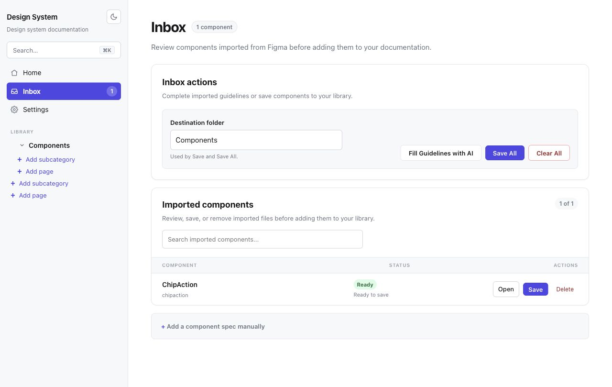

# Spec Layer

[](https://github.com/SamsonHD/spec-layer/actions/workflows/ci.yml)
[](LICENSE)
[](https://nodejs.org)

Spec Layer is a local-first toolkit for turning Figma components into structured Markdown design-system documentation. It combines a Figma plugin, a deterministic extractor, an open Markdown format, and a Next.js authoring app.

The project is currently intended for trusted local development. The web app reads and writes files on the host machine and is not hardened as a public multi-user service.



## Contents

- [What Works](#what-works)
- [Requirements](#requirements)
- [Quick Start](#quick-start)
- [Figma Plugin](#figma-plugin)
- [Configuration](#configuration)
- [Commands](#commands)
- [Repository Layout](#repository-layout)
- [Content Safety](#content-safety)
- [Roadmap](#roadmap)
- [Contributing](#contributing)
- [License](#license)

## What Works

- Extract a selected Figma component or component set into a structured spec.
- Export one component as Markdown or all components as a ZIP archive.
- Send an extraction from the Figma plugin to the local docs app.
- Import Markdown or ZIP files manually.
- Review imported components in an inbox, fill missing guidelines, save them individually or in bulk, and clear unwanted drafts.
- Browse, search, reorganize, and edit Markdown sections in the docs app.
- Render Figma previews when a personal access token is configured.
- Check the saved library against Figma and surface out-of-date, missing, and undocumented components (drift detection), with a per-selection status in the plugin and a Sync overview in the app.
- Resolve drift by re-extracting in Figma and applying a section-preserving **Update** from the Inbox (or one-click from the component page), which refreshes the structural data while keeping written guidelines.
- Optionally fill Definition, Accessibility, and Do's & Don'ts with Anthropic, without overwriting human prose during bulk fill.
- Store specs in any local folder through `DS_CONTENT_DIR`.

There is no enforced approval workflow. The optional `status` frontmatter field is a label only.

## Requirements

- Node.js 20.9 or newer
- npm 10 or newer
- Figma desktop for local plugin development

## Quick Start

```bash
npm ci
cp apps/web/.env.example apps/web/.env.local
npm run dev -w md-ds
```

Open [http://localhost:3000](http://localhost:3000). The development server binds to `localhost` (loopback only).

The app starts without credentials and with an empty inbox. To use your own Markdown folder, set `DS_CONTENT_DIR` in `apps/web/.env.local` and restart the server.

## Figma Plugin

Build the plugin:

```bash
npm run build:plugin
```

In Figma desktop, choose **Plugins → Development → Import plugin from manifest**, then select `packages/plugin/manifest.json`.

To use **Send to docs**:

1. Make sure the web app is running.
2. In the plugin's **Settings** tab, set the docs URL using the **`localhost`** hostname — e.g. `http://localhost:3000`, or `http://localhost:3001` if your server started on that port. **Do not use `127.0.0.1`:** Figma's plugin manifest can only allowlist the `localhost` hostname (it rejects raw IP literals), so a `127.0.0.1` URL is blocked before the request leaves the plugin and surfaces as `Failed to fetch`. Both names point to the same loopback server.

> The manifest (`packages/plugin/manifest.json`) allowlists `http://localhost:3000` and `http://localhost:3001`. To use any other host or port, add it to the manifest's `networkAccess.allowedDomains` (hostnames only — not IPs) and reload the plugin in Figma.

No token or account is needed. The plugin posts from its opaque origin, which the server permits automatically; same-origin and host-allowlist checks protect the local API.

## Configuration

| Variable | Purpose |
|---|---|
| `DS_CONTENT_DIR` | Folder containing component Markdown files. Defaults to `apps/web/content/components`. |
| `SPEC_LAYER_ALLOWED_HOSTS` | Additional comma-separated `Host` values, including ports when present. |
| `SPEC_LAYER_ALLOWED_ORIGINS` | Additional comma-separated cross-origin origins. `Origin: null` (the Figma plugin) is permitted automatically. |
| `FIGMA_TOKEN` | Optional Figma personal access token for preview images. |
| `ANTHROPIC_API_KEY` | Optional Anthropic key for prose generation. |

Figma and Anthropic credentials can also be stored through the app's Settings page. They are written to `.ds-config.json` with owner-only permissions where the platform supports them. Environment variables are preferable for shared or automated environments.

## Commands

```bash
npm run dev -w md-ds  # local docs app
npm run lint           # ESLint
npm run typecheck      # all TypeScript workspaces
npm test               # Vitest suite
npm run build          # production web build
npm run build:plugin   # Figma plugin bundle
npm run check          # complete local verification
```

## Repository Layout

```text
apps/web/              Next.js authoring and documentation app
packages/format/       frontmatter schema and Markdown serialization
packages/extractor/    pure Figma-tree extraction and rendering
packages/plugin/       Figma plugin and bulk export UI
spec/                  format definition and reference examples
```

See [ARCHITECTURE.md](ARCHITECTURE.md) for data flow and trust boundaries, and [spec/SPEC.md](spec/SPEC.md) for the Markdown contract.

Release history is recorded in [CHANGELOG.md](CHANGELOG.md).

## Content Safety

Generated imports are runtime data and are ignored under `apps/web/content/components/_inbox/`. Do not commit API keys, private Figma URLs, customer data, proprietary component exports, `.ds-config.json`, `.spec-cache`, `.spec-data` sidecars, or the `.spec-sync.json` drift report.

ZIP and upload endpoints enforce compressed, expanded, per-file, and entry-count limits. API host and origin checks are defense-in-depth for local use, not a substitute for authentication, authorization, and isolation in a public deployment.

## Roadmap

- Git-backed content synchronization.
- One-click import of components that exist in Figma but aren't documented yet.
- MCP tools for searching and retrieving reviewed specs.
- Optional packaging of stable workspace APIs after their contracts are ready for independent versioning.

## Contributing

Read [CONTRIBUTING.md](CONTRIBUTING.md), [SECURITY.md](SECURITY.md), and [CODE_OF_CONDUCT.md](CODE_OF_CONDUCT.md) before opening a change. Bug reports and fixtures must use synthetic or explicitly publishable data. Use GitHub private vulnerability reporting for security issues.

## License

MIT. See [LICENSE](LICENSE).
